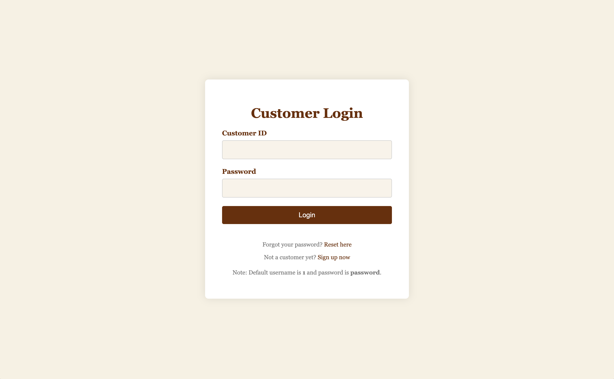
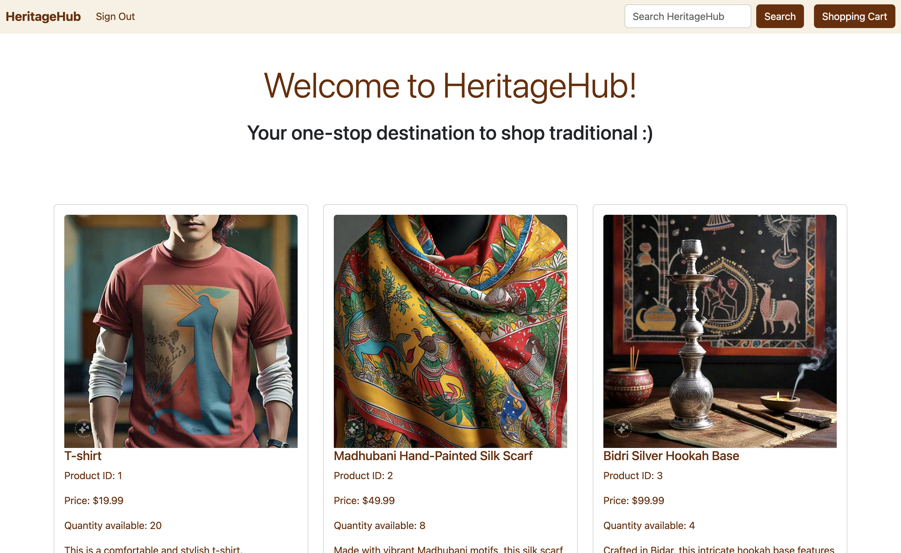
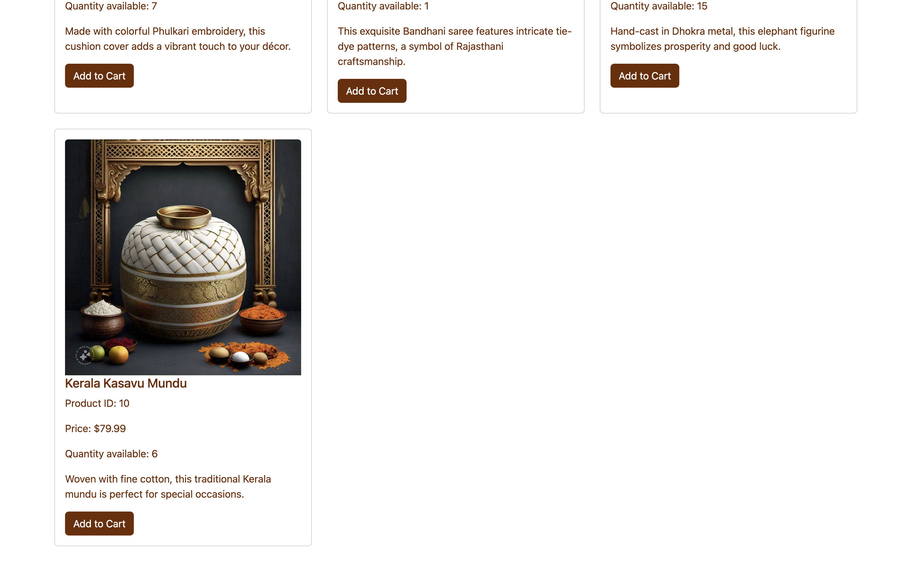
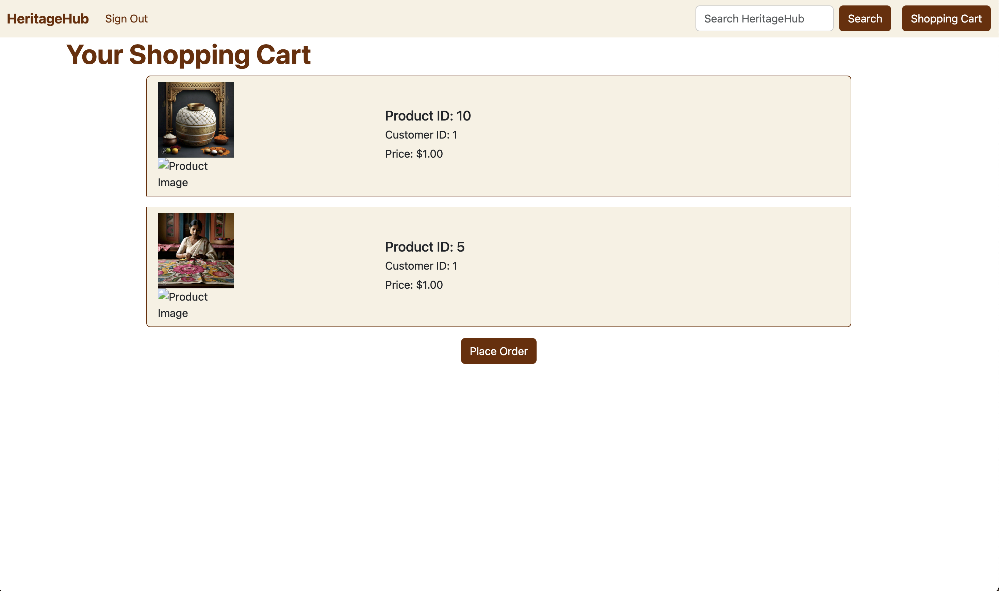
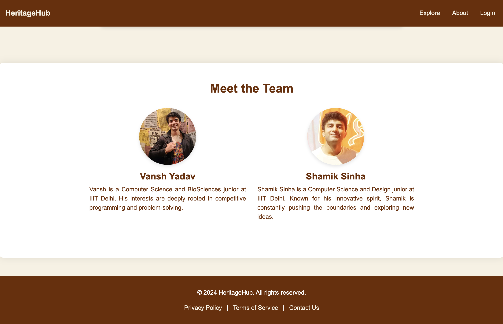
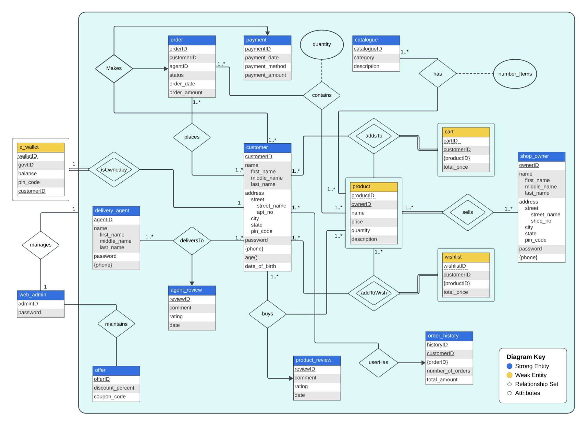
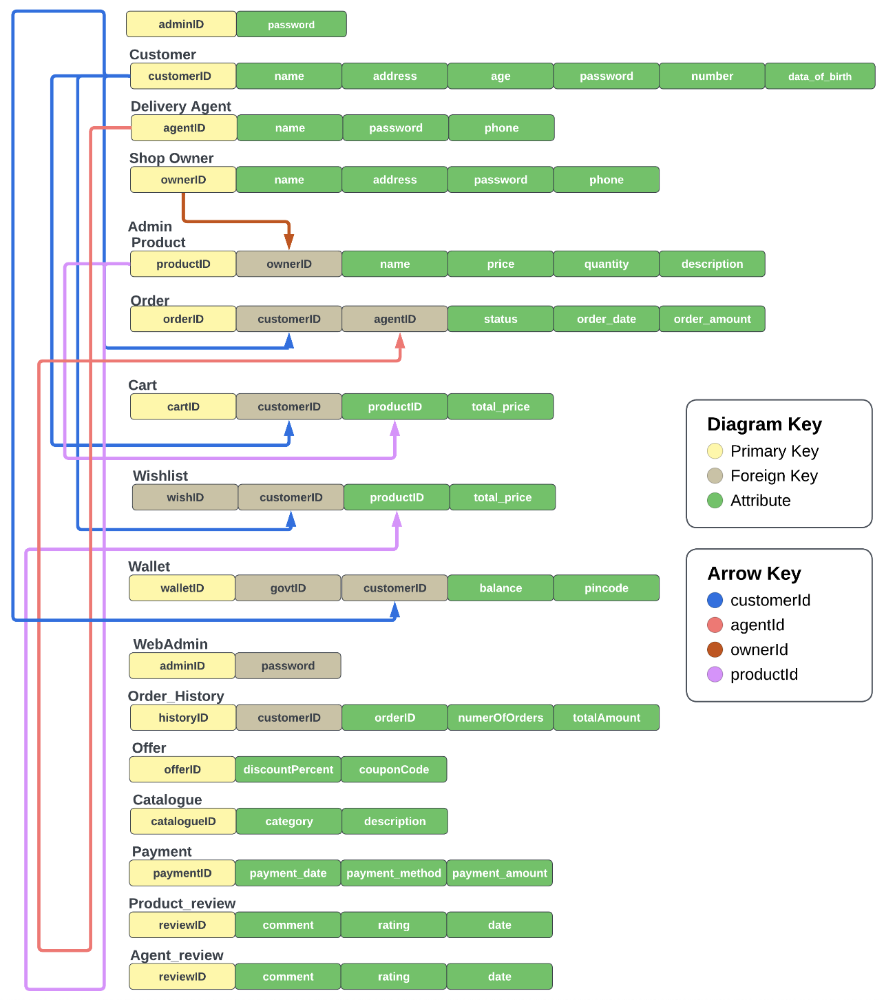

# HeritageHub Project

HeritageHub is a web application aimed at preserving and promoting cultural heritage sites.

## Project Overview

Describe the purpose and goals of your project briefly.

## Features

- List key features of the application.

## Technologies Used

- Python
- Flask
- MySQL
- HTML/CSS
- JavaScript
 

## Installation

Provide instructions on how to set up and run your project locally.

## Usage

Provide instructions on how to use the application.

## Project Images

### Image 0

*Description of image 0.*

### Image 1

*Description of image 1.*

### Image 2

*Description of image 2.*

### Image 2.5

*Description of image 2.5.*

### Image 3

*Description of image 3.*

### Image 4

*Description of image 4.*

### Image 5

*Description of image 5.*

### Image 6

*Description of image 6.*

### Image 7

*Description of image 7.*

### Image 9

*Description of image 9.*

## Database Diagrams

### Entity-Relationship Diagram

*ER Diagram illustrating the database structure.*

### Relational Diagram

*Relational Diagram showing database tables and relationships.*

## Demo

Visit the live demo [here](http://heritagehubonline.pythonanywhere.com/).

## Contributors

- [Shamik Sinha](https://github.com/theshamiksinha)
- [Vansh Yadav](https://github.com/other_team_member)

## License

This project is licensed under the MIT License - see the [LICENSE](LICENSE) file for details.
